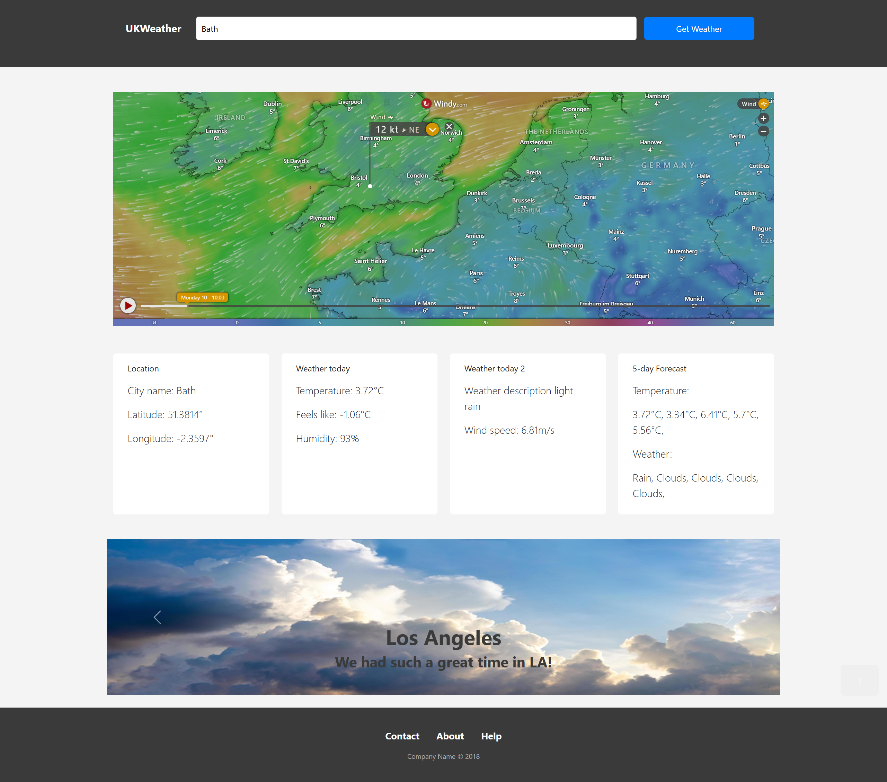
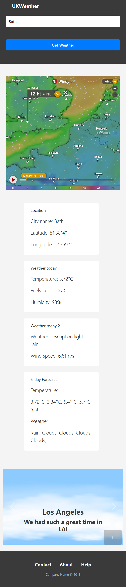

# weather-app challenge

We work as a group to create a weather application that makes tow API calls. One to get the latitud and the longitud and the other to get the weather.

[Live website](https://gonzalopena1.github.io/weather-app/)

## Technologies
We used HTML, CSS, Javascript, OpenWeather API, Bootstrap

## Collaborators

[@GonzaloPena1](https://github.com/GonzaloPena1)

[@Sp0li](https://github.com/Sp0li)

[@UchechukwuUchendu](https://github.com/UchechukwuUchendu)

## Project Demo

